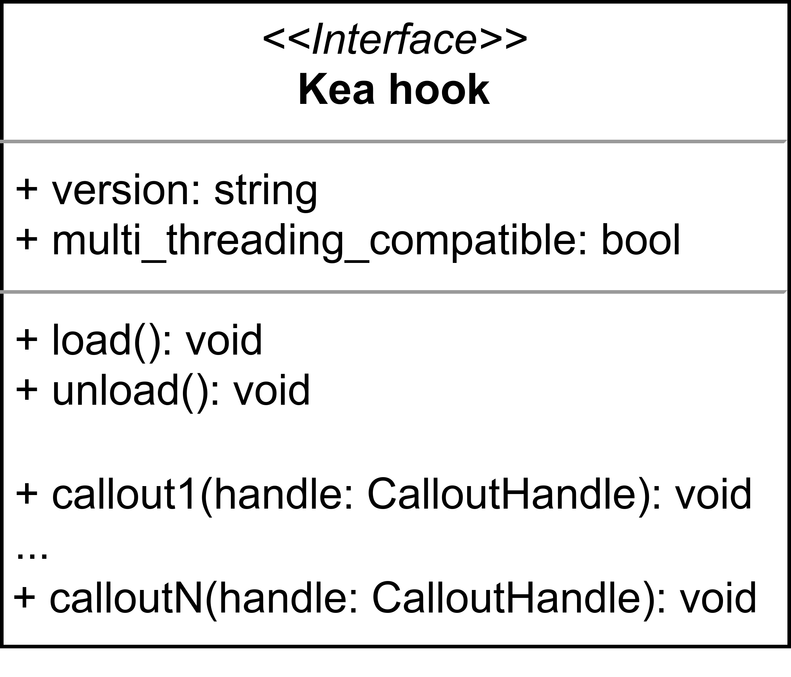
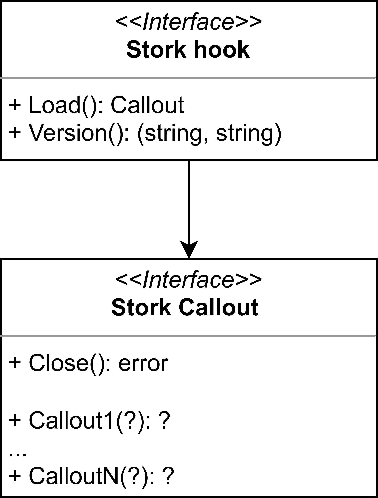
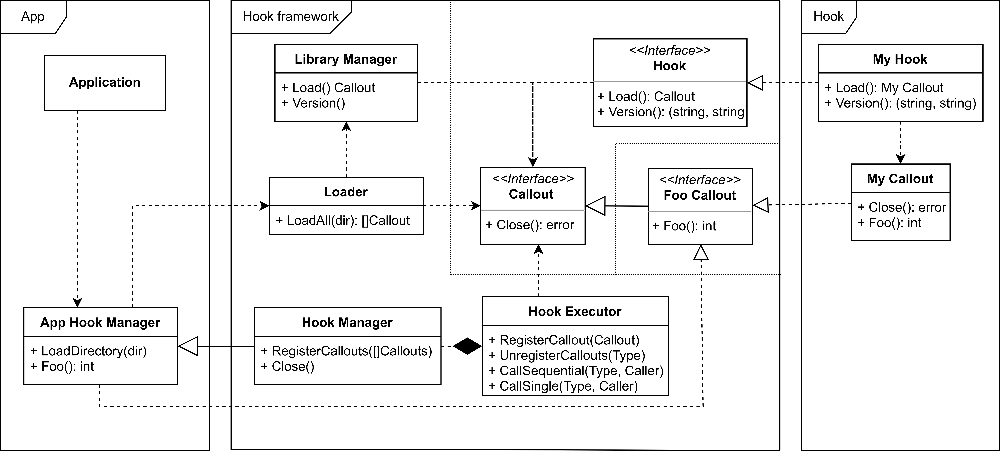
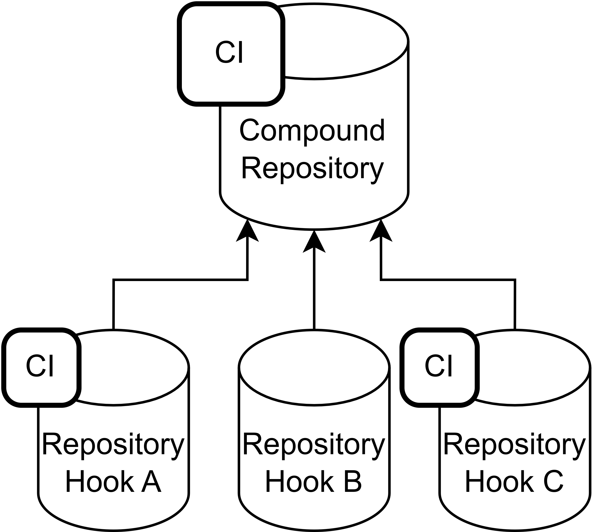

[comment]: # (Set the theme:)
[comment]: # (THEME = white)
[comment]: # (CODE_THEME = shades-of-purple)
[comment]: # (The list of themes is at https://revealjs.com/themes/)
[comment]: # (The list of code themes is at https://highlightjs.org/)

Sławek Figiel | ISC | November 3, 2022

# Stork hooks

 <!-- .element: style="height:10vh; max-width:80vw; image-rendering: crisp-edges;" -->

[comment]: # (!!!)

## Agenda

1. Kea solution
2. Hook interface
3. Hook framework
4. Pros and cons
5. To implement
6. Repository organization

[comment]: # (!!!)

## Kea hook interface

 <!-- .element: style="height:50vh; max-width:80vw; image-rendering: crisp-edges;" -->

[comment]: # (||| data-background-color="#05c46b")

### Kea solution - pros and cons

Advantages:

- Minimal effort to implement new hook
- Optional callouts
- Version checking

Disadvantages:

- Checking the callout argument types only in runtime
- Missing application checking

[comment]: # (!!! data-background-color="#05c46b")

## Stork hook interface

 <!-- .element: style="height:50vh; max-width:80vw; image-rendering: crisp-edges;" -->

[comment]: # (||| data-background-color="#0fbcf9")

plugin.go - common for all hooks:

```go [1-3|5-7|9-12]
func Load() (hooks.Callout, error) {
	return &callout{}, nil
}

func Version() (string, string) {
	return hooks.HookProgramAgent, hooks.StorkVersion
}

var (
	_ hooks.HookLoadFunction    = Load
	_ hooks.HookVersionFunction = Version
)

```

[comment]: # (||| data-background-color="#0fbcf9")

callout.go - specific for each hook

```go [1|2-4|6|7-10]
type callout struct{}
func (c *callout) Close() error {
	return nil
}

var _ foocallout.FooCallout = (*callout)(nil)
func (c *callout) Foo() int {
  return 42
}
```

foocallout.go - defined in core

```go
type FooCallout interface {
  Foo() int
}
```

[comment]: # (!!! data-background-color="#0fbcf9")

## Hook framework

 <!-- .element: style="height:50vh; width:80vw; image-rendering: crisp-edges; object-fit: contain;" -->

[comment]: # (!!!)

## Pros and cons

Benefits:

- Static (compilation-time) type checking
- Isolating hook calling and the core codebase
- Callouts are pure functions

Threats:

- Hooks are static linking. Dependency of callout signature types must be built-in into a hook.
- The number of dependencies (and output size) may quickly grow

[comment]: # (!!!)

## To implement

#### 1. Hooks configuration

- CLI flags defined by hooks
  - Merged with standard CLI (including help)
  - Separate prefix for each hook
  - Support for environment variables
- Settings database table
  - Persistent storage
  - Dedicated wrapper to avoid DB dependencies in hooks
  - Challenge: Migrating schema

[comment]: # (|||)

#### 2. Exchange data between hooks

- By `context.Context` (done)
- By passing previous output as next input
- By gRPC
- Interrupting callout chain execution

[comment]: # (|||)

#### 3. Hook management

- REST API endpoint
- UI for hooks
- Performance monitoring
- Loading/unloading/reloading hooks
- Reconfiguration hooks in runtime

[comment]: # (!!!)

## Repository organization

- Single repository for single hook
- Compound repository for ISC hooks
  - Git submodules
  - Common CI (build, linting, testing, packaging)

 <!-- .element: style="height:25vh; width:80vw; image-rendering: crisp-edges; object-fit: contain;" -->

[comment]: # (!!!)

# Q&A

[comment]: # (!!!)
