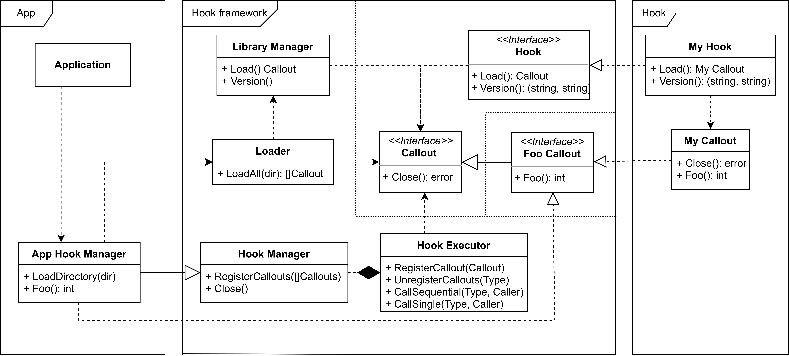

[comment]: # (Set the theme:)
[comment]: # (THEME = white)
[comment]: # (CODE_THEME = shades-of-purple)
[comment]: # (The list of themes is at https://revealjs.com/themes/)
[comment]: # (The list of code themes is at https://highlightjs.org/)

Sławek Figiel | ISC | November 3, 2022

# Stork hooks

 <!-- .element: style="height:10vh; max-width:80vw; image-rendering: crisp-edges;" -->

[comment]: # (!!!)

## Agenda

1. Kea solution
2. Key goals
3. Hook interface
4. Hook framework
5. Pros and cons
6. To implement
7. Repository organization

[comment]: # (!!!)

## Kea solution - hook interface

 <!-- .element: style="height:50vh; max-width:80vw; image-rendering: crisp-edges;" -->

[comment]: # (|||)

### Kea solution - pros and cons

Advantages:

- Minimal effort to implement new hook
- Optional callouts
- Version checking

Disadvantages:

- Checking the callout argument types only in runtime
- Missing application checking

[comment]: # (!!!)

### Hook interface

 <!-- .element: style="height:50vh; max-width:80vw; image-rendering: crisp-edges;" -->

[comment]: # (|||)

### Hook interface - implementation

plugin.go - common for all hooks:

```go [1-3|5-7|9-12]
func Load() (hooks.Callout, error) {
	return &callout{}, nil
}

func Version() (string, string) {
	return hooks.HookProgramAgent, hooks.StorkVersion
}

var (
	_ hooks.HookLoadFunction    = Load
	_ hooks.HookVersionFunction = Version
)

```

[comment]: # (|||)

### Hook interface - implementation

callout.go - specific for each hook

```go [1|2-4|6|7-10]
type callout struct{}
func (c *callout) Close() error {
	return nil
}

var _ foocallout.FooCallout = (*callout)(nil)
func (c *callout) Foo() int {
  return 42
}
```

foocallout.go - defined in core

```go
type FooCallout interface {
  Foo() int
}
```

[comment]: # (!!!)

## Hook framework

 <!-- .element: style="height:50vh; width:80vw; image-rendering: crisp-edges; object-fit: contain;" -->

[comment]: # (!!!)

## Pros and cons

Advantages:

- Static (compilation-time) type checking
- Isolating hook calling and the core codebase
- Callouts are pure functions

Disadvantages:

- Hooks are static linking. Dependency of callout signature types must be built-in into a hook.
- The number of dependencies (and output size) may quickly grow

[comment]: # (!!!)

## To implement

- Hooks configuration (CLI, DB)
- Exchange data between hook
- REST API & UI for hooks - monitoring and management

[comment]: # (!!!)

## Repository organization

- Single repository for single hook
- Compound repository for ISC hooks
  - Git submodules
  - Common CI (build, linting, testing, packaging)

 <!-- .element: style="height:25vh; width:80vw; image-rendering: crisp-edges; object-fit: contain;" -->

[comment]: # (!!!)

# Q&A

[comment]: # (!!!)
